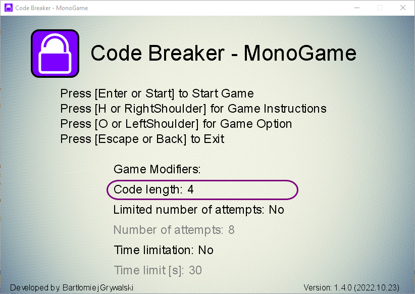
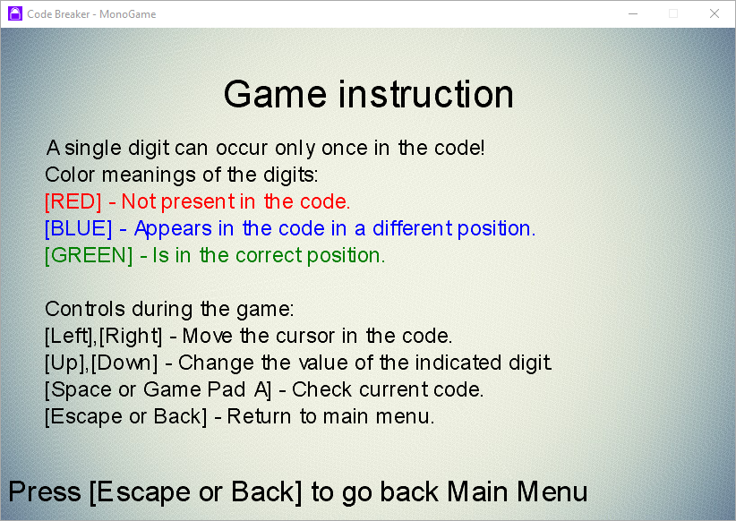
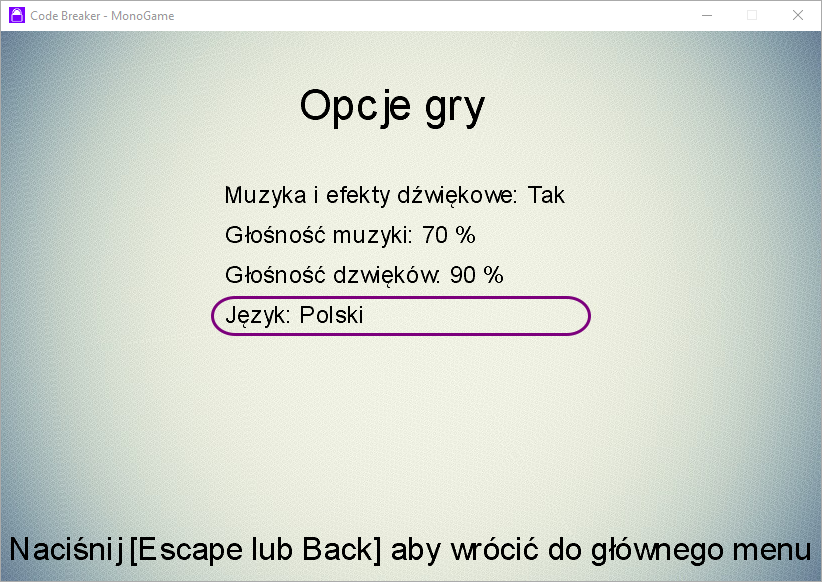
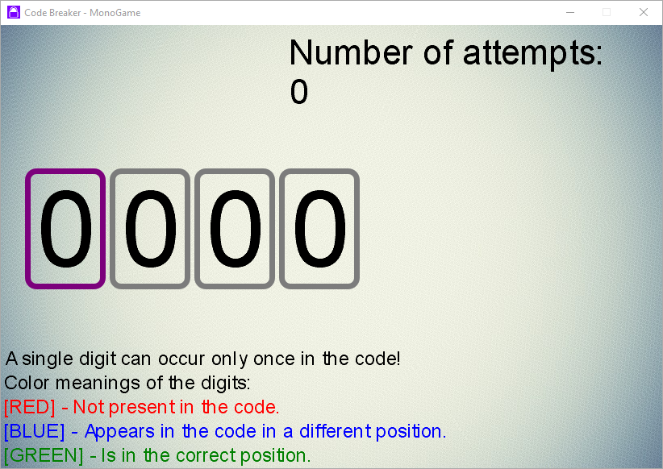
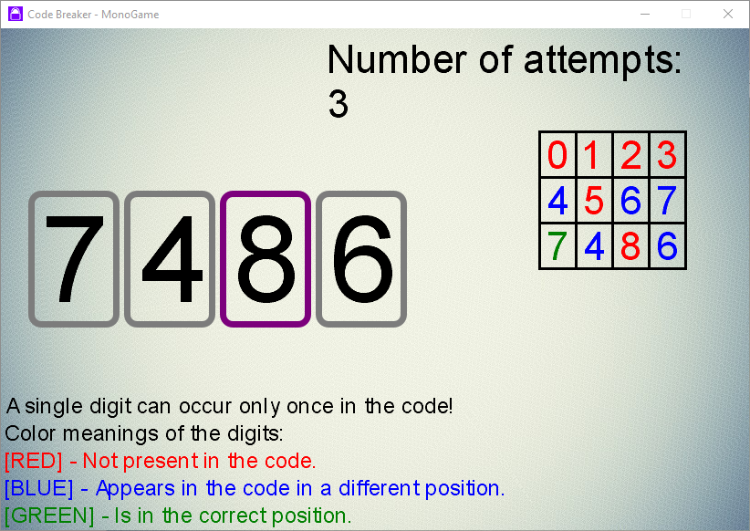
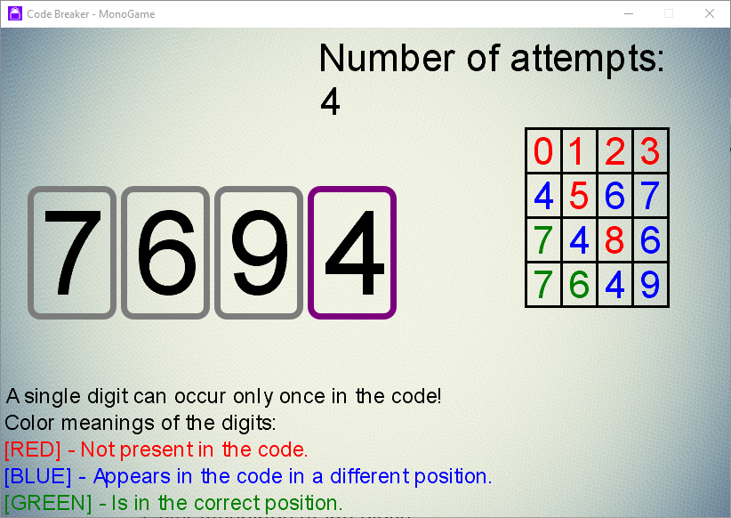
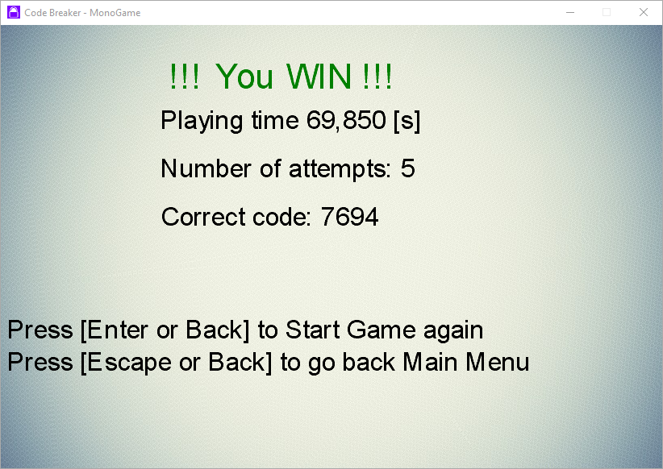
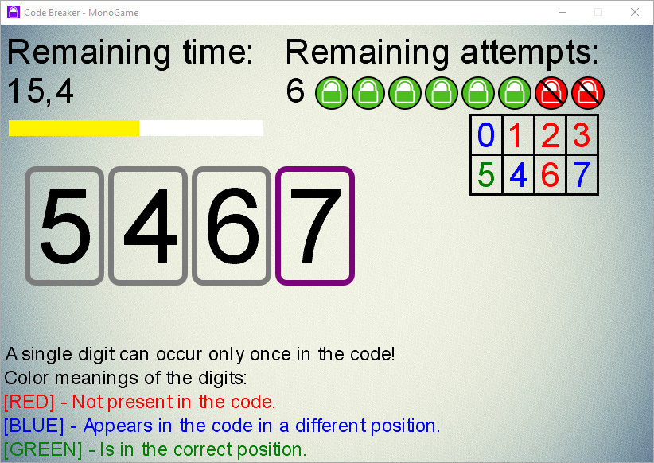
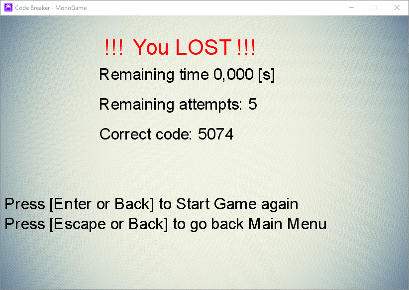

# Code Breaker - MonoGame
It is a code-breaking puzzle game. A single digit can occur only once in the code. If the selected digit occurs elsewhere in the code, you get a hint about it by color coding. 

Color meanings of the digit:
- [RED] - Not present in the code.
- [BLUE] - Appears in the code in a different position.
- [GREEN] - Is in the correct position.

The game ends when you guess the entire code.

The game allows you to guess the code in unlimited time and number of attempts. It also has several possible modes to make the game more difficult: limited number of attempts or limited time. You can also choose the number of digits the code consists of.

The game supports multilingual features, supported languages: English, Polish.

This is my first original game (not based on a tutorial). The game focuses more on game logic, without advanced graphics. This game uses the MonoGame framework. 

## Screenshots

### 1. Main menu

### 2. Game instruction

### 3. Option game in Polish language

### 4. After game start

### 5. All possible digit clues

### 6. Before game end

### 7. Successful game

### 8. Possible game modyfication

### 9. Unsuccessful game

