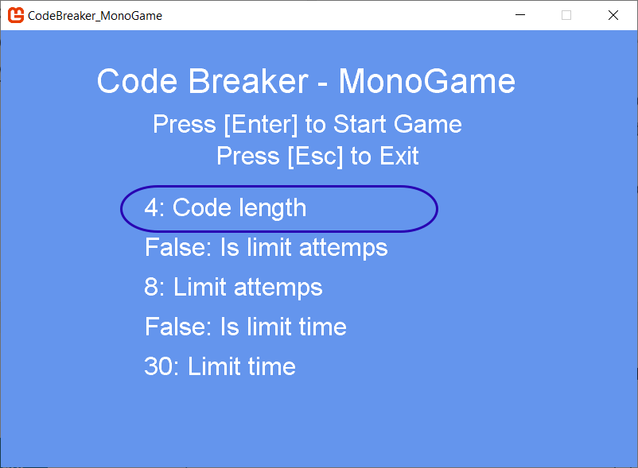
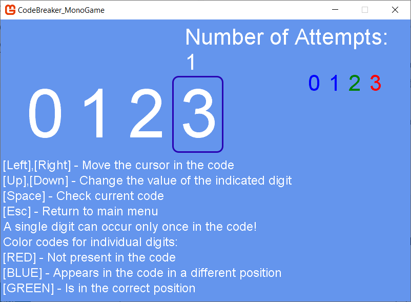
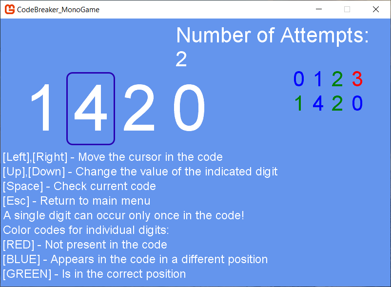
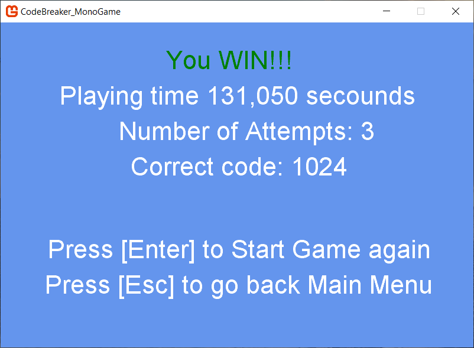
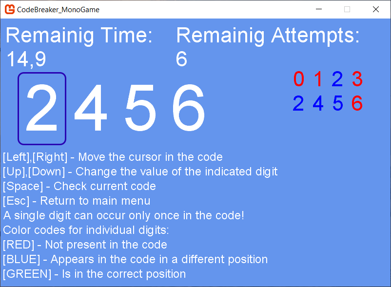

# Code Breaker - MonoGame
It is a code-breaking puzzle game. A single digit can occur only once in the code. If the selected digit occurs elsewhere in the code, you get a hint about it. The game ends when you guess the entire code.

The game allows you to guess the code in unlimited time and number of attempts. It also has several possible modes to make the game more difficult: limited number of tries or limited time. You can also choose the number of digits the code consists of.

This is my first original game (not based on a tutorial). The game focuses more on game logic, without advanced graphics. This game uses the MonoGame framework. 

## Screenshots

### 1. Main menu

### 2. After game start

### 3. All possible digit clues

### 4. Before game end

### 5. Successful game

### 6. Possible modes

### 7. Unsuccessful game

